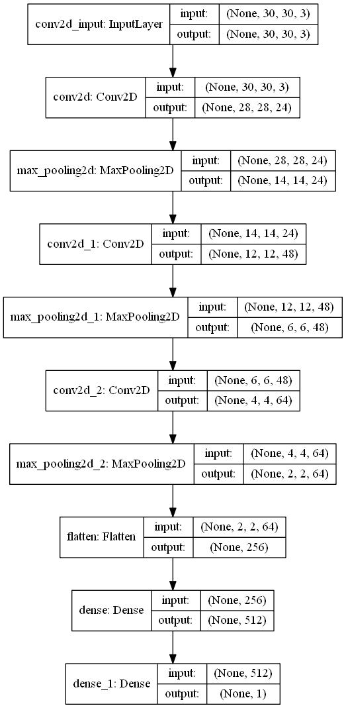

# Neural Network for assessing fiddler crabs handedness

This notebook trains and evaluate a simple neural network which predict male fiddler crab handedness (or clawedness, i.e. right or left enlarged major claw). Images for training, validation and testing were obtained using [Crabspy](https://github.com/CexyNature/Crabspy).

Model architecture:

The notebook can be found in the following repository: 